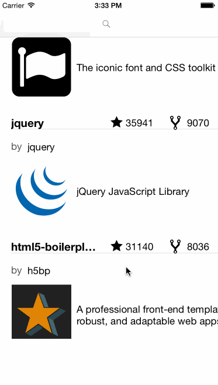

# iOSTraining_Day2_Labwork
Github client

Time spent: 3 hours spent in total

Completed user stories:
 * [x] Required:Milestone 3: Create a Table with Custom Cells for the Repo Results
 * [] Required:Milestone 4: Create a Settings Page to Configure the Search
 * [] Required:Milestone 5: Allow Filtering By Language

Notes:
The auto layout doesn't work as expected on the table cells. wasted most of the time laying out them.
give up for it now, as need more time for the home work.

Walkthrough of all user stories:

